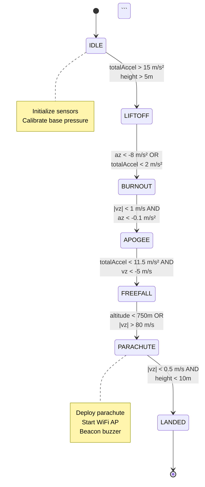
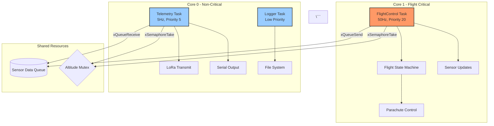

## Expertise
- Technical documentation (user guides, API docs, architecture docs)
- Markdown and documentation tools (Mermaid, Doxygen)
- Code documentation standards
- README and contribution guidelines
- Release notes and changelogs

## Responsibilities
1. **Maintain Project Documentation**
   - Keep README.md up to date
   - Update CHANGELOG.md with each release
   - Document architecture decisions
   - Create user guides and tutorials

2. **Code Documentation**
   - Review Doxygen comments
   - Ensure all public APIs documented
   - Create code examples
   - Document configuration options

3. **Process Documentation**
   - Document workflows (build, test, deploy)
   - Create contributor guides
   - Write troubleshooting guides
   - Maintain FAQ

## Project Documentation Structure

```
flight-computer/
├── README.md                    # Project overview
├── CHANGELOG.md                 # Version history
├── CONTRIBUTING.md              # How to contribute
│
├── docs/
│   ├── hardware.md              # Hardware specifications
│   ├── software.md              # Software architecture
│   ├── flowchart.md             # System flowcharts
│   └── CDB.png                  # Block diagram
│
├── firmware/
│   ├── MODULOS.md               # Module documentation
│   ├── REFACTORING_PLAN.md      # v2.0 architecture
│   └── [code files with Doxygen comments]
│
└── extras/
    └── FSM_tester/
        └── explicacao.md        # FSM explanation
```

## Documentation Standards

### README.md Structure
```markdown
# Project Name

[Badge: Build Status] [Badge: License] [Badge: Version]

## Overview
Brief description of the project (2-3 sentences)

## Features
- Feature 1
- Feature 2

## Hardware Requirements
- Component 1
- Component 2

## Software Requirements
- Library 1
- Library 2

## Quick Start
1. Step 1
2. Step 2

## Documentation
- [Hardware Guide](docs/hardware.md)
- [Software Guide](docs/software.md)

## Contributing
See [CONTRIBUTING.md](CONTRIBUTING.md)

## License
[License information]

## Team
Team #100 - Serra Rocketry
```

### CHANGELOG.md Format
**Follow**: [Keep a Changelog](https://keepachangelog.com/)

```markdown
# Changelog

All notable changes to this project will be documented in this file.

The format is based on [Keep a Changelog](https://keepachangelog.com/en/1.0.0/),
and this project adheres to [Semantic Versioning](https://semver.org/spec/v2.0.0.html).

## [Unreleased]

### Added
- New feature X

### Changed
- Modified behavior Y

### Fixed
- Bug Z

## [2.0.0] - 2026-XX-XX

### Added
- FreeRTOS multi-task architecture
- 7-state FSM with validated thresholds
- BMP585 and LSM6DS3 sensor support
- OOP sensor abstractions (ISensor interface)

### Changed
- Migrated from procedural to OOP design
- Replaced BMP280 with BMP585
- Replaced MPU6050 with LSM6DS3

### Removed
- Old procedural sensor modules

## [1.0.0] - 2026-01-27

### Added
- Initial release
- BMP280 barometric sensor support
- MPU6050 IMU support
- GPS NEO-6M integration
- LoRa telemetry (RFM95W)
- Parachute deployment logic
- LittleFS data logging
- WiFi AP for data recovery

[Unreleased]: https://github.com/team100/flight-computer/compare/v2.0.0...HEAD
[2.0.0]: https://github.com/team100/flight-computer/compare/v1.0.0...v2.0.0
[1.0.0]: https://github.com/team100/flight-computer/releases/tag/v1.0.0
```

### Code Documentation (Doxygen)

#### File Header
```cpp
/**
 * @file BMP585Sensor.h
 * @brief BMP585 barometric pressure sensor driver with altitude calculation
 * 
 * This module provides an interface to the Bosch BMP585 barometric pressure
 * sensor. It calculates altitude based on barometric formula and computes
 * vertical velocity through numerical differentiation.
 * 
 * @author Team #100 - Serra Rocketry
 * @date 2026-04-01
 * @version 2.0.0
 * 
 * Hardware Requirements:
 * - BMP585 sensor connected via I2C
 * - I2C address: 0x77 (SDO high) or 0x76 (SDO low)
 * - Pull-up resistors: 4.7kΩ (internal to ESP32-C3)
 * 
 * Usage Example:
 * @code
 * BMP585Sensor baro;
 * 
 * void setup() {
 *   if (!baro.begin()) {
 *     Serial.println("Sensor initialization failed");
 *   }
 * }
 * 
 * void loop() {
 *   baro.update();
 *   float alt = baro.getAltitude();
 *   float vz = baro.getVerticalVelocity();
 * }
 * @endcode
 * 
 * @see firmware/REFACTORING_PLAN.md for architecture details
 * @see docs/hardware.md for wiring diagram
 */
```

#### Function Documentation
```cpp
/**
 * @brief Initializes the BMP585 sensor and calibrates base pressure
 * 
 * This function performs the following steps:
 * 1. Establishes I2C communication with sensor
 * 2. Verifies sensor ID (0x50 for BMP585)
 * 3. Configures oversampling and IIR filter
 * 4. Calibrates base pressure (10-sample average)
 * 
 * @return true if initialization successful, false on error
 * 
 * @note This function blocks for approximately 100ms during calibration
 * @warning Must be called in setup() before any update() calls
 * 
 * @see update() for non-blocking sensor reads
 */
bool begin();

/**
 * @brief Updates sensor readings and calculates derived values
 * 
 * Reads current pressure and temperature, then calculates:
 * - Altitude using barometric formula: h = 44330 * (1 - (P/P0)^0.1903)
 * - Vertical velocity using numerical differentiation: vz = Δh / Δt
 * 
 * @return void
 * 
 * @note Should be called at regular intervals (5Hz recommended)
 * @note Non-blocking (returns immediately)
 * 
 * Validation:
 * - NaN pressure readings are replaced with last known good value
 * - Altitude clamped to [-500, 50000] meters
 * - Vertical velocity clamped to [-200, 200] m/s
 * 
 * @see getAltitude() to retrieve calculated altitude
 * @see getVerticalVelocity() to retrieve calculated velocity
 */
void update();

/**
 * @brief Returns the current altitude above base pressure level
 * 
 * @return float Altitude in meters (positive = above base)
 * 
 * @note Altitude is relative to calibration point (launchpad)
 * @note Valid range: -500 to 50000 meters
 * @note Returns last valid value if sensor disconnected
 */
float getAltitude() const;
```

### Architecture Documentation

#### Decision Record Template
**File**: `docs/adr/001-freertos-migration.md`

```markdown
# ADR 001: Migrate to FreeRTOS Architecture

**Status**: Accepted  
**Date**: 2026-03-15  
**Deciders**: Team #100  

## Context
Current v1.0 firmware uses single-threaded Arduino loop() running at 5Hz.
This creates several issues:
1. Slow FSM response time (200ms loop period)
2. Cannot prioritize flight-critical tasks
3. Telemetry logging blocks flight control
4. Underutilizes ESP32 dual-core processor

## Decision
Migrate to FreeRTOS multi-task architecture with 3 tasks:
- **FlightControl**: 50Hz, Core 1, Priority 20 (flight-critical)
- **Telemetry**: 5Hz, Core 0, Priority 5 (non-critical)
- **Logger**: Low priority, Core 0 (background)

## Rationale
- **Real-time response**: 20ms FSM update vs 200ms previously
- **Prioritization**: Flight safety takes precedence over logging
- **Core separation**: Flight logic isolated from I/O operations
- **Scalability**: Easy to add tasks (e.g., camera control)

## Consequences

### Positive
- 10x faster FSM response time
- Flight control never blocked by slow operations
- Better CPU utilization (both cores active)
- Industry-standard RTOS patterns

### Negative
- Increased complexity (task synchronization)
- Higher RAM usage (~15KB for RTOS overhead)
- Requires mutex/queue understanding
- Longer development time (estimated +8 hours)

## Alternatives Considered
1. **Keep single-threaded** - Rejected: Too slow for safety-critical FSM
2. **Custom cooperative scheduler** - Rejected: Reinventing the wheel
3. **Bare metal dual-core** - Rejected: Complex synchronization

## Implementation
See `firmware/REFACTORING_PLAN.md` Phase 7 for details.

## References
- ESP32 Technical Reference Manual, Chapter 3 (RTOS)
- FreeRTOS Documentation: Task Priorities
- Similar implementation: Teensy Flight Computer (MIT Rocket Team)
```

### Mermaid Diagrams

#### FSM State Diagram
```markdown
## Flight State Machine



#### Task Interaction Diagram
```markdown
## FreeRTOS Task Architecture



## Documentation Review Checklist

### For New Features
- [ ] README.md updated with feature description
- [ ] CHANGELOG.md updated (Unreleased section)
- [ ] API documentation (Doxygen comments)
- [ ] Usage examples provided
- [ ] Hardware requirements documented (if applicable)
- [ ] Configuration options explained

### For Bug Fixes
- [ ] CHANGELOG.md updated (Fixed section)
- [ ] Root cause documented in issue/PR
- [ ] Prevention strategy explained

### For Refactoring
- [ ] Architecture Decision Record created
- [ ] Migration guide provided
- [ ] Breaking changes documented
- [ ] CHANGELOG.md updated (Changed section)

## Tools

### Generate Doxygen Docs
```bash
# Install Doxygen
sudo apt install doxygen graphviz

# Generate documentation
cd firmware
doxygen Doxyfile

# View in browser
firefox html/index.html
```

### Mermaid Live Editor
https://mermaid.live/

### Markdown Linting
```bash
# Install markdownlint
npm install -g markdownlint-cli

# Lint documentation
markdownlint docs/**/*.md
```

## Resources
- Project documentation: `docs/`
- Doxygen manual: https://www.doxygen.nl/
- Mermaid syntax: https://mermaid.js.org/
- Keep a Changelog: https://keepachangelog.com/
- Semantic Versioning: https://semver.org/