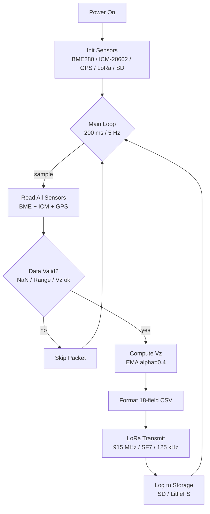
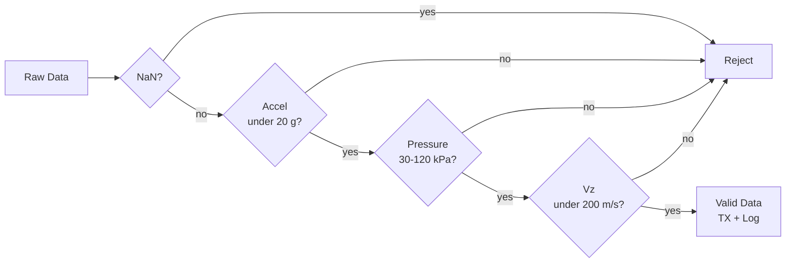
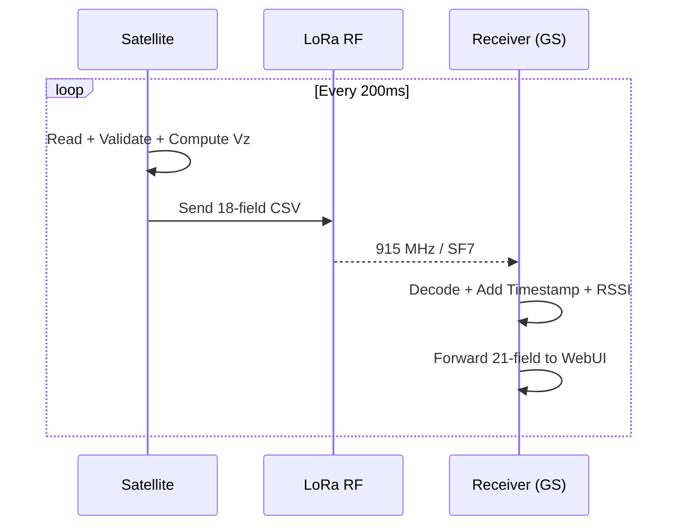

# Flowchart Simplificado — Helike PocketQube

## Diagrama Unico (Boot + Loop Principal)

```mermaid
flowchart TD
    START[Power On] --> INIT[Init Sensors\nBME280 / ICM-20602 / GPS / LoRa / SD]
    INIT --> MAIN{Main Loop\n200 ms / 5 Hz}
    MAIN -->|sample| READ[Read All Sensors\nBME + ICM + GPS]
    READ --> VALIDATE{Data Valid?\nNaN / Range / Vz ok}
    VALIDATE -->|no| SKIP[Skip Packet]
    VALIDATE -->|yes| VZ[Compute Vz\nEMA alpha=0.4]
    VZ --> FORMAT[Format 18-field CSV]
    FORMAT --> TX[LoRa Transmit\n915 MHz / SF7 / 125 kHz]
    TX --> LOG[Log to Storage\nSD / LittleFS]
    SKIP --> MAIN
    LOG --> MAIN
```

## Pipeline de Validacao

```mermaid
flowchart LR
    RAW[Raw Data] --> NAN{NaN?}
    NAN -->|yes| REJECT[Reject]
    NAN -->|no| ACCEL{Accel\nunder 20 g?}
    ACCEL -->|no| REJECT
    ACCEL -->|yes| PRESS{Pressure\n30-120 kPa?}
    PRESS -->|no| REJECT
    PRESS -->|yes| VZ_RANGE{Vz\nunder 200 m/s?}
    VZ_RANGE -->|no| REJECT
    VZ_RANGE -->|yes| ACCEPT[Valid Data\nTX + Log]
```

## LoRa Packet Flow

```mermaid
sequenceDiagram
    participant S as Satellite
    participant L as LoRa RF
    participant R as Receiver (GS)

    loop Every 200ms
        S->>S: Read + Validate + Compute Vz
        S->>L: Send 18-field CSV
        L-->>R: 915 MHz / SF7
        R->>R: Decode + Add Timestamp + RSSI
        R->>R: Forward 21-field to WebUI
    end
```
