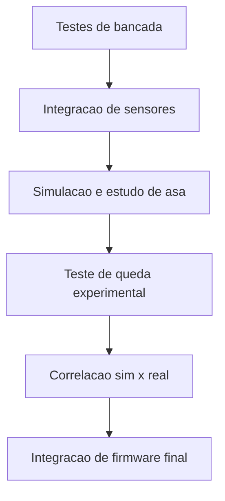
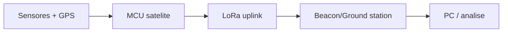

# Fluxos do Sistema

## Fluxo macro de desenvolvimento

```mermaid
flowchart TD
    A[Testes de bancada] --> B[Integracao de sensores]
    B --> C[Simulacao e estudo de asa]
    C --> D[Teste de queda experimental]
    D --> E[Correlacao sim x real]
    E --> F[Integracao de firmware final]
```

## Fluxo de telemetria (alto nivel)

```mermaid
flowchart LR
    S[Sensores + GPS] --> M[MCU satelite]
    M --> L[LoRa uplink]
    L --> B[Beacon/Ground station]
    B --> P[PC / analise]
```
