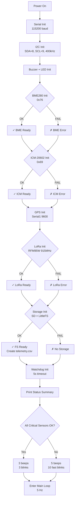
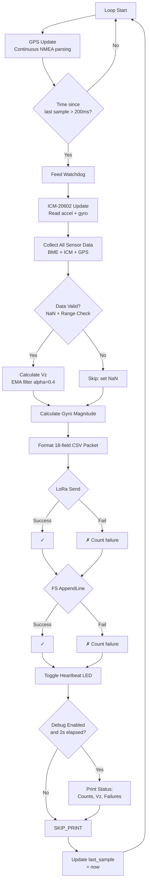
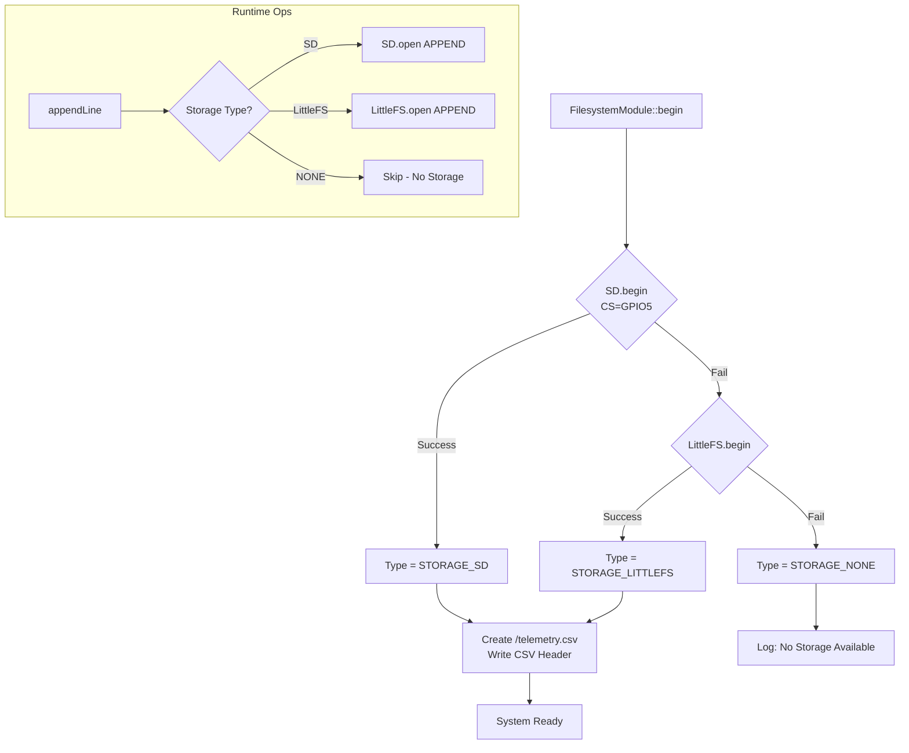
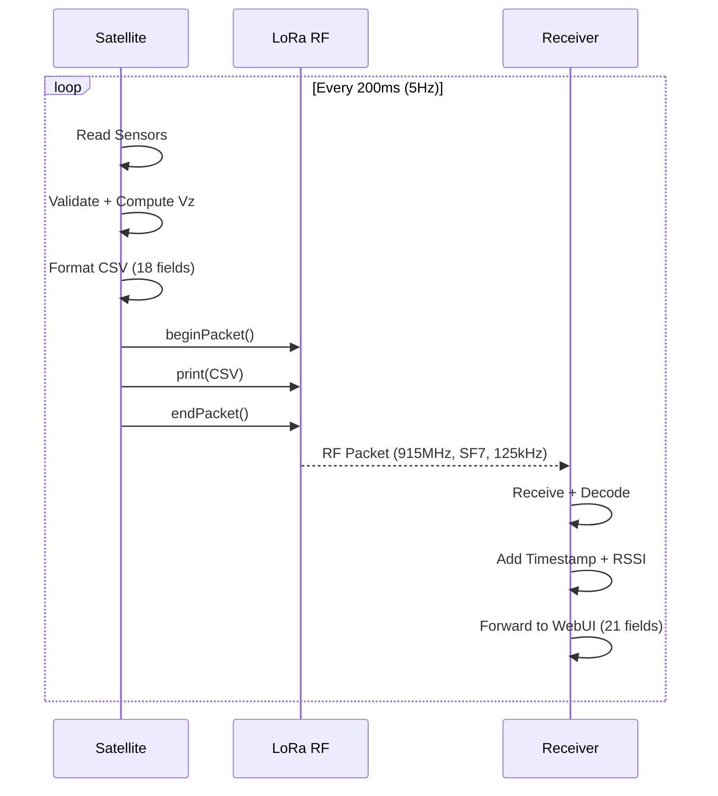
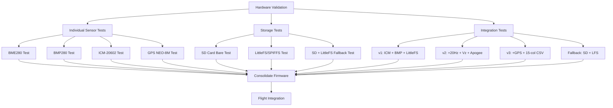

# System Flowcharts

## Boot and Initialization Sequence



## Main Telemetry Loop



## Data Validation Pipeline

```mermaid
flowchart LR
    RAW[Raw Sensor Data] --> NAN{NaN Check\nax, ay, az,\npressure, altitude, vz}
    NAN -->|Any NaN| REJECT[✗ Reject Packet]
    NAN -->|All valid| ACCEL_MAG{Accel Magnitude\n< 20g?}
    ACCEL_MAG -->|≥ 20g| REJECT
    ACCEL_MAG -->|< 20g| PRESSURE{Pressure Range\n30-120 kPa?}
    PRESSURE -->|Out of range| REJECT
    PRESSURE -->|In range| VZ_RANGE{|Vz| < 200 m/s?}
    VZ_RANGE -->|≥ 200 m/s| REJECT
    VZ_RANGE -->|< 200 m/s| ACCEPT[✓ Valid Data → Process & Transmit]
```

## Storage Fallback Decision



## LoRa Telemetry Packet (Satellite → Receiver)



## Hardware Test Flowchart


