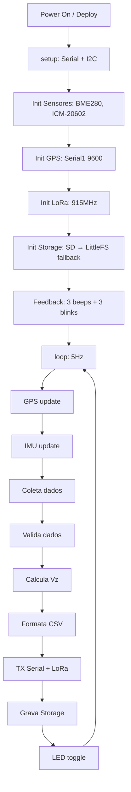
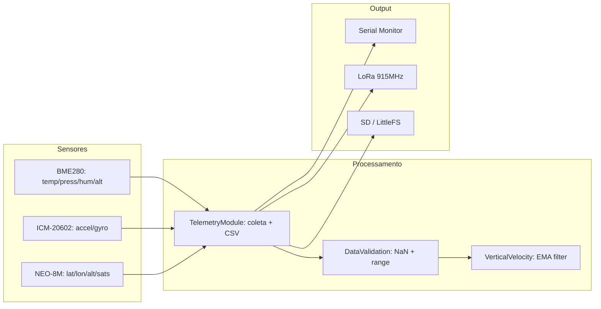
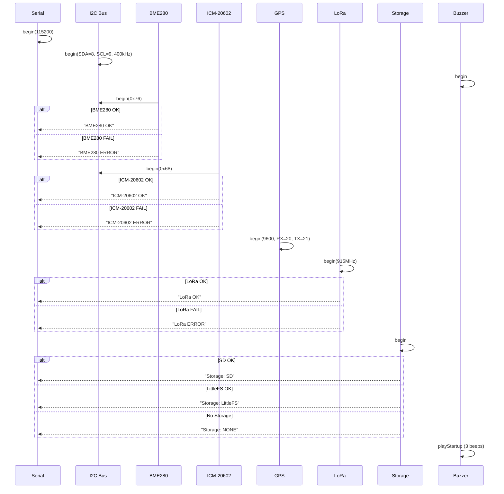
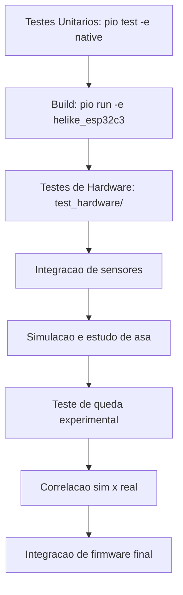

# Fluxos do Sistema

## Fluxo de Operacao (Runtime)



## Fluxo de Dados



## Fluxo de Storage (SD + LittleFS Fallback)

```mermaid
flowchart TD
    A[begin] --> B{Tenta SD.begin(CS)}
    B -->|Sucesso| C[storage_type = STORAGE_SD]
    B -->|Falha| D{Tenta LittleFS.begin}
    D -->|Sucesso| E[storage_type = STORAGE_LITTLEFS]
    D -->|Falha| F[storage_type = STORAGE_NONE]
    C --> G[Operacões de arquivo via SD lib]
    E --> H[Operacões de arquivo via LittleFS lib]
    F --> I[Sem logging local]
```

## Fluxo de Inicializacao Detalhado



## Fluxo de Telemetria (Loop Principal)

```
A cada 200ms (5Hz):

1. GPS update (sempre)
   - Le bytes do Serial1
   - Alimenta TinyGPSPlus parser

2. IMU update
   - Le 6 bytes accel (0x3B-0x40)
   - Le 6 bytes gyro (0x43-0x48)
   - Converte para m/s² e rad/s

3. Coleta BME280
   - readTemperature() → °C
   - readPressure() → Pa
   - readHumidity() → %
   - getAltitude() → m

4. Coleta GPS
   - getTimeString() → "HH:MM:SS"
   - getLatitude/getLongitude → graus
   - getAltitude() → m
   - getSatellites() → count

5. Validacao
   - Verifica NaN em todos os campos
   - Verifica ranges fisicos
   - Marca dados como validos/invalidos

6. Calculo Vz
   - Vz = (altura_atual - altura_anterior) / dt
   - Filtro EMA: vz_filt = alpha * vz_filt + (1-alpha) * vz_raw

7. Formatacao CSV
   - TEAM_ID,millis,count,altp,temp,umi,p,gp,gr,gy,ap,ar,ay,alt,lat,lon,sat,rssi

8. Transmissao
   - Serial.println(packet)
   - LoRa.send(packet)
   - Storage.appendLine(packet)

9. Heartbeat
   - LED toggle
```

## Fluxo de Desenvolvimento


