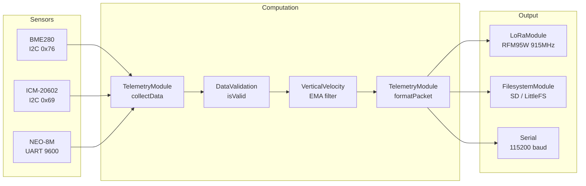

# Software Architecture

## Overview

The satellite firmware runs on an ESP32-C3 Super Mini (single-core RISC-V,
400KB RAM, 4KB default stack). The system uses a continuous loop architecture
with no FSM, no FreeRTOS, and no sleep mode — the satellite powers on already
descending and runs until recovery.

## Architecture Diagram



## Module Structure

### `src/main.cpp` — Entry Point

- `setup()`: Initializes Serial, I2C, sensors, then **single SPI bus init
  → LoRa → storage (SD→LittleFS)**, watchdog. Boot order is load-bearing:
  the radio must be configured before any SD mount attempt, and SPI must
  be initialized exactly once (see ADR-005 and hardware.md Known Issues).
- `loop()`: Runs at 5Hz (SAMPLE_INTERVAL_MS = 200ms):
  1. Read GPS (continuous)
  2. Update IMU
  3. Collect sensor data via TelemetryModule
  4. Validate data via DataValidation
  5. Calculate Vz via VerticalVelocity (EMA filter, alpha=0.4)
  6. Build 18-field CSV packet
  7. Transmit via Serial + LoRa
  8. Log to SD/LittleFS
  9. Toggle heartbeat LED
  10. Feed watchdog

### `src/config.h` — Global Configuration

| Section | Key Defines |
|---------|-------------|
| Identification | `TEAM_ID`, `MISSION_NAME` |
| Pinout | `I2C_SDA/SCL`, `LORA_*`, `SD_CS_PIN`, `GPS_*`, `LED/BUZZER_PIN` |
| Timing | `SAMPLE_INTERVAL_MS=200`, `LORA_INTERVAL_MS=200`, `GPS_READ_INTERVAL_MS=1000` |
| LoRa | `LORA_FREQ=915E6`, `SYNC_WORD=0xF3`, `SF=7`, `BW=125E3` |
| Sensors | `BME280_ADDR`, `ICM20602_ADDR`, validation thresholds |
| Watchdog | `WATCHDOG_TIMEOUT_MS=5000` |
| Debug | `DEBUG_ENABLED`, `USE_LITTLEFS` |

### `src/sensors/` — Sensor Drivers

All sensors implement the `ISensor` abstract interface:

- `ISensor.h` — Pure virtual interface (begin, update, isReady, hasNewData, markDataRead)
- `BME280Sensor` — Temperature, pressure, humidity (BME280) or NAN (BMP280 fallback), barometric altitude (I2C)
- `ICM20602Sensor` — 3-axis accelerometer (±16g), 3-axis gyroscope (±2000°/s) via raw I2C
- `GPSSensor` — NEO-8M GPS with TinyGPSPlus parser (UART)

### `src/modules/` — System Modules

| Module | File | Description |
|--------|------|-------------|
| LoRaModule | `LoRaModule.h/.cpp` | RFM95W SPI driver (915MHz, SF7, 125kHz) |
| TelemetryModule | `TelemetryModule.h/.cpp` | Data collection, CSV formatting, transmission |
| FilesystemModule | `FilesystemModule.h/.cpp` | SD primary + LittleFS fallback |
| LEDModule | `LEDModule.h/.cpp` | Heartbeat and status LED (GPIO3) |
| BuzzerModule | `BuzzerModule.h/.cpp` | Startup/error beeps via digitalWrite (GPIO0, active buzzer) |

### `lib/calc/` — Calculation Library (Header-only, No Hardware Deps)

| Module | Description |
|--------|-------------|
| `SensorData.h` | Unified telemetry struct (17 fields) |
| `VerticalVelocity.h` | EMA-filtered Vz from altitude differential |
| `ApogeeDetection.h` | Apogee detection by Vz threshold crossing |
| `DataValidation.h` | NaN and range validation against physical limits |

## Data Flow

### CSV Packet Format (18 fields + end-of-packet marker)

```text
TEAM_ID,millis,count,altp,temp,umi,p,gp,gr,gy,ap,ar,ay,alt,lat,lon,sat,rssi#
```

| Field | Source | Unit | Description |
|-------|--------|------|-------------|
| TEAM_ID | config | - | Team identifier (#213) |
| millis | millis() | ms | System timestamp |
| count | TelemetryModule | - | Packet sequence number |
| altp | BME280 | m | Barometric altitude |
| temp | BME280 | °C | Temperature |
| umi | BME280 / BMP280 | % | Humidity (NAN if BMP280 fallback) |
| p | BME280 | hPa | Atmospheric pressure |
| gp | ICM-20602 | rad/s | Gyroscope X |
| gr | ICM-20602 | rad/s | Gyroscope Y |
| gy | ICM-20602 | rad/s | Gyroscope Z |
| ap | ICM-20602 | m/s² | Accelerometer X |
| ar | ICM-20602 | m/s² | Accelerometer Y |
| ay | ICM-20602 | m/s² | Accelerometer Z |
| alt | GPS | m | GPS altitude (MSL) |
| lat | GPS | deg | Latitude |
| lon | GPS | deg | Longitude |
| sat | GPS | - | Satellite count |
| rssi | placeholder | dBm | RSSI (-1, filled by receiver) |
| **#** | **terminator** | - | **End-of-packet marker** |

**`#` end-of-packet marker**: The `#` character terminates every packet. The
ground station receiver uses it to verify integrity: if a line does not end
with `#`, the packet was truncated or corrupted during LoRa transmission and
should be discarded.

Time/date fields are intentionally omitted — they are filled by the ground
station receiver using its local GPS for precise synchronization.

### Validation Pipeline

```mermaid
flowchart LR
    A[Raw Sensor Data] --> B{isNaN?}
    B -->|Yes| C[Reject]
    B -->|No| D{Accel < 20g?}
    D -->|No| C
    D -->|Yes| E{Pressure\n30-120 kPa?}
    E -->|No| C
    E -->|Yes| F{|Vz| < 200 m/s?}
    F -->|No| C
    F -->|Yes| G[Valid Data]
```

### Vertical Velocity (EMA Filter)

Vz is computed using numerical differentiation with an Exponential Moving
Average filter:

```text
vz_raw = (altitude - altitude_prev) / dt
vz_filt = alpha * vz_raw + (1 - alpha) * vz_filt_prev
```

Where `alpha = 0.4` (configured in main.cpp).

### Apogee Detection

Apogee is detected when Vz crosses below a configurable negative threshold
(default: -0.5 m/s). The detector:

- Tracks peak altitude during ascent
- Records the exact timestamp of apogee
- Tracks maximum descent speed after apogee
- Fires only once per flight (single-shot)

## Unit Testing

Three native test suites using the Unity framework:

| Suite | File | Tests | Description |
|-------|------|-------|-------------|
| test_vz | `test/test_vz/` | 7 | Vz calculation, EMA, zero dt, reset |
| test_apogee | `test/test_apogee/` | 7 | Detection, tracking, single-shot, reset |
| test_validation | `test/test_validation/` | 11 | NaN, range checks, liberal config |

Run with:

```bash
pio test -e native
```

## Key Design Decisions

1. **No FSM, no sleep** — Satellite powers on already descending
2. **Static global objects** — No heap allocation, deterministic RAM usage
3. **SD primary, LittleFS fallback** — Runtime storage detection
4. **TinyGPSPlus** — Higher-level NMEA parsing vs manual
5. **PlatformIO** — Build + native tests in one toolchain
6. **5Hz sample rate** — 200ms interval, adequate for descent phase
