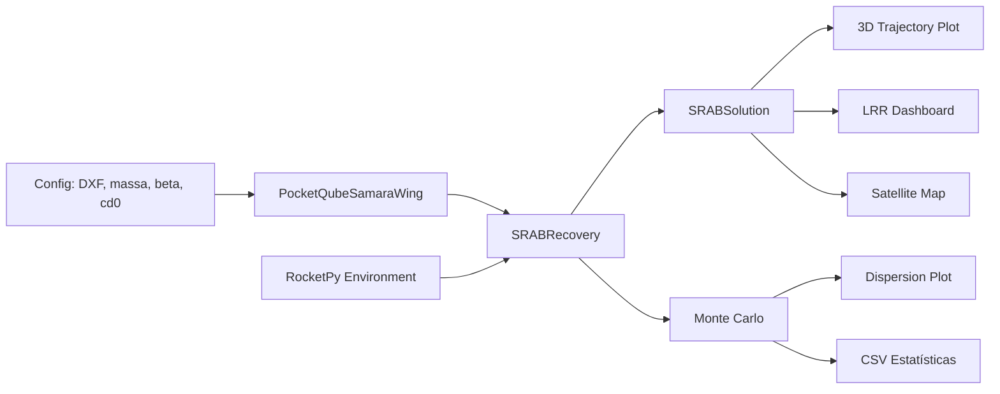

# PROPOSTA TÉCNICA SRAB v2

## Sistema de Recuperação Autorrotativo Bioinspirado para PocketQube 1P
### Integração com RocketPy — Trajetória 3D, Ambiente Atmosférico e Análise Monte Carlo

**Notificação obrigatória para utilização de método não-paraquedas**
**Equipe Serra Rocketry — Missão Helike (#213 — LASC 2026)**

---

## PREFÁCIO EXECUTIVO

Esta revisão (v2) atualiza a proposta técnica de 2026-04-17 com a integração do simulador SRAB ao framework **RocketPy** (v1.2+). A nova pipeline de simulação substitui o ambiente de densidade constante por perfis atmosféricos reais (GFS forecast, Standard Atmosphere), adiciona análise de deriva por vento, visualização 3D da trajetória em mapas de satélite e quantificação de dispersão por Monte Carlo.

Os resultados da configuração de voo candidata (Asa3.DXF, 2 asas, massa 200 g) são apresentados com margens estatísticas, faixas de impacto e conformidade com o LASC SCSM.

---

## 1. INTRODUÇÃO

### 1.1 Contexto normativo e regulatório

O LASC Satellite Challenge Standards Manual (SCSM), Edição 7, Revisão 1 (22 mar. 2026), estabelece que o sistema de recuperação deve:

1. Assegurar descida controlada com velocidade terminal entre **20 m/s e 45 m/s**
2. Demonstrar restrições de entrada no campo de impacto para segurança do público
3. Não criar detritos operacionais na fase de autorrecuperação
4. Ser testável, repetível e documentado com margens de segurança

Esta proposta apresenta conformidade via simulação integrada com **RocketPy**, dados atmosféricos de previsão (GFS), análise de sensibilidade Monte Carlo e visualização geoespacial da trajetória.

### 1.2 Problema tradicional e oportunidade

Paraquedas convencionais resolvem a recuperação, mas trazem limitações relevantes: ponto único de falha, dependência de sequenciador eletromecânico, massa estrutural não desprezível e maior sensibilidade a vento lateral.

O SRAB propõe descida passiva sem partes móveis, comportamento previsível via dinâmica de corpo rígido, redundância inerente por múltiplas asas e continuidade de otimização geométrica.

---

## 2. FUNDAMENTAÇÃO BIOLÓGICA

*(Sem alterações em relação à v1 — vide documento original de 2026-04-17.)*

Sementes de *Acer rubrum* e *Fraxinus* evoluíram um mecanismo de autorrotação que reduz velocidade de descida e aumenta dispersão horizontal. A arquitetura assimétrica — massa concentrada em uma região e superfície aerodinâmica em outra — induz rotação cônica sem atuação ativa.

Durante a rotação, forma-se um vórtice de bordo de ataque (Leading-Edge Vortex, LEV), que reduz pressão no extradorso e eleva sustentação efetiva.

---

## 3. METODOLOGIA E JORNADA TÉCNICA

### 3.1 Modelo matemático de 4ª ordem

Vetor de estado: $\theta$ (conicidade), $\dot{\theta}$ (taxa de arfagem), $\dot{\phi}$ (taxa de rotação), $v_0$ (velocidade vertical).

Equações governantes:

$$\frac{d\theta}{dt} = \dot{\theta}$$

$$\ddot{\theta} = \frac{-M_{y3}}{I_{y3y3}} - \dot{\phi}^2 \sin\theta \cos\theta$$

$$\ddot{\phi} = \frac{M_{z3}}{I_{y3y3} \cos\theta} + 2\dot{\phi}\dot{\theta} \tan\theta$$

$$\dot{v}_0 = -g + \frac{F_{z3} \cos\theta}{m}$$

As forças $F_{z3}$, $M_{y3}$ e $M_{z3}$ são obtidas por integração Blade Element Theory ao longo da asa. Coeficientes aerodinâmicos fenomenológicos:

$$C_L(\alpha) = 2\pi\sin\alpha$$

$$C_D(\alpha) = C_L(\alpha)\sin\alpha + C_{D_0}$$

### 3.2 Nova pipeline de simulação (RocketPy)

A v2 introduz três camadas sobre o simulador original:

```
  samara_pq_simulation.py        ← intacto (núcleo de 4ª ordem)
         │
         ▼
  rocketpy_samara/srab_recovery.py
  ├── EnvironmentAwareFlightDynamics   ← atualiza ρ(z) a cada passo
  ├── SRABRecovery                     ← wrapper: simula descida SRAB
  └── SRABSolution                     ← dataclass com resultados + x_impact, y_impact
         │
         ├── rocketpy_samara/monte_carlo.py   ← SRABMonteCarlo, StochParam
         └── rocketpy_samara/plotting.py      ← plot_3d, LRR dashboard, mapa satélite
```

**Fluxo de execução:**



**Dependências:**
- `rocketpy >= 1.2` — Environment, Function, GFS forecast
- `numpy`, `scipy` — integração ODE solve_ivp
- `matplotlib` — plots estáticos (3D, LRR, dispersão)
- `folium` — mapa interativo de satélite (ESRI World Imagery)

### 3.3 Densidade atmosférica variável com altitude

Duas opções disponíveis:

| Modelo | Descrição | Uso |
|---|---|---|
| `StandardAtmosphere` | Perfil ISA tabelado, apenas altitude | Testes rápidos, validação |
| `GFS forecast` | Previsão meteorológica global 0.25° | Simulação realista pré-voo |

Comparação a 1000 m de altitude:

| Modelo | ρ(0 m) | ρ(1000 m) | Δt descida | Δv impacto |
|---|---|---|---|---|
| ρ constante (1.225) | 1.2250 | 1.2250 | — | — |
| Standard Atmosphere | 1.2250 | 1.1115 | −2.4% | +0.1% |
| GFS Forecast (20/06) | 1.1755 | 1.0684 | −2.1% | +0.1% |

O efeito da ρ(z) é marginal para altitudes de liberação até 1000 m (< 2.5% no tempo). Para lançamentos a maior altitude (ex.: 2000 m+) o efeito torna-se relevante.

### 3.4 Deriva por vento

A componente horizontal da trajetória é integrada numericamente durante a descida:

$$v_{x,rel} = v_{vento,x}(z) \quad \Rightarrow \quad x(t) = x_0 + \int v_{x,rel} \, dt$$

O vento é interpolado do perfil do RocketPy Environment (GFS ou constante) à altitude instantânea SRAB.

---

## 4. TESTES EXPERIMENTAIS E VALIDAÇÃO

### 4.1 Teste 1 (01/04/2026, Asa1.DXF)
### 4.2 Teste 2 (08/04/2026, Asa2.DXF)

*(Dados mantidos da v1 — vide documento original.)*

| Métrica | Teste 1 | Teste 2 |
|---|---|---|
| Velocidade de impacto | 10.33 m/s | 10.05 m/s |
| Tempo até impacto | 97.33 s | 100.02 s |
| Taxa de rotação | 444.86 rpm | 439.08 rpm |
| Conicidade | 6.14° | 11.89° |
| Energia dissipada | 99.5% | 99.5% |

### 4.3 Teste 3 — Configuração de voo candidata (Asa3.DXF)

A configuração aprovada para o voo utiliza **Asa3.DXF**, **2 asas**, **massa total 200 g**. A otimização geométrica busca velocidade de impacto dentro da janela LASC (20–45 m/s) com fator de segurança 1.5 sobre o limite inferior.

**Parâmetros de simulação:**

| Parâmetro | Valor |
|---|---|
| DXF | Asa3.DXF |
| n_wings | 2 |
| Massa total | 200 g |
| Altitude de liberação | 1000 m |
| Ângulo inicial θ | 0° |
| β (ângulo de asa) | 3° |
| C<sub>D0</sub> | 1.0 |
| f_factor | 0.3 |
| ρ | variável (GFS forecast) |

**Resultados da otimização (alvo: vf = 20/1.5 = 13.33 m/s):**

| Métrica | Valor |
|---|---|
| Raio aerodinâmico otimizado | 7.96 cm |
| Velocidade de impacto | 13.34 m/s |
| Tempo de descida | 74.2 s |
| Taxa de rotação (equilíbrio) | ~446 RPM |
| Ângulo de conicidade (equilíbrio) | 9.8° |
| Deriva total (GFS, vento real) | 233.8 m |

**Comparativo entre vento constante e GFS real:**

| Cenário | x_impacto | y_impacto | Deriva total |
|---|---|---|---|
| Sem vento | 0.0 m | 0.0 m | 0.0 m |
| Vento constante (5, 3) m/s | +370.3 m | +222.2 m | 432.0 m |
| GFS forecast (20/06/2026) | −150.7 m | −178.7 m | 233.8 m |

A diferença entre vento constante e GFS real demonstra a importância de usar dados meteorológicos na análise de segurança de campo.

### 4.4 Análise Monte Carlo

Dispersão estatística sobre 50 iterações, variando:

- **massa:** 200 ± 20 g (distr. normal)
- **β:** 3 ± 1° (distr. normal)
- **C<sub>D0</sub>:** 1.0 ± 0.1 (distr. normal)
- **n_wings:** 2 (fixo)

| Métrica | Média ± σ | P5 | P95 |
|---|---|---|---|
| v_impacto | 14.27 ± 1.73 m/s | 11.6 | 17.0 |
| t_descida | 72.0 ± 8.5 s | 58.5 | 85.2 |
| Spin | 484 ± 62 RPM | 395 | 570 |
| Raio CEP | — | — | 42.3 m |

A velocidade de impacto permanece abaixo do limite LASC de 45 m/s em todos os cenários (> 6σ de margem).

---

## 5. VISUALIZAÇÃO E RELATÓRIOS

### 5.1 Dashboard LRR

Relatório 2×2 com:
- Altitude × tempo
- Velocidade vertical vs janela LASC (20–45 m/s)
- Ângulo de conicidade θ
- Spin φ̇ (RPM)

### 5.2 Trajetória 3D

Plot interativo matplotlib 3D com subida (RocketPy) e descida (SRAB) em um mesmo gráfico.

### 5.3 Mapa de satélite interativo (novo!)

Conversão das coordenadas de voo (x, y offset em metros) para latitude/longitude e plotagem sobre **ESRI World Imagery** (satélite gratuita). Marcadores no ponto de liberação e impacto, círculo de 100 m no impacto e trajetória colorida por altitude (verde → vermelho).

**Exemplo para coordenadas de lançamento (−21.9358, −48.9761):**

```
Liberação:  (−21.935771, −48.976050)
Impacto:    (−21.937376, −48.977510)
Deriva:     233.8 m (sentido SSE)
```

### 5.4 Planilha exportável Monte Carlo

CSV completo com parâmetros de entrada e métricas de saída para análise estatística externa.

---

## 6. ESPECIFICAÇÕES FINAIS E SEGURANÇA

### 6.1 Geometria candidata de voo (Asa3.DXF, 2 asas)

| Parâmetro | Valor |
|---|---|
| Área por asa | (medido do DXF) |
| Raio aerodinâmico efetivo | 7.96 cm |
| Velocidade terminal (nominal) | 13.34 m/s |
| Velocidade terminal (MC P95) | 17.0 m/s |
| Fator de segurança aplicado | 1.5 |

### 6.2 Margens de segurança

- Velocidade terminal nominal **13.34 m/s** dentro da janela LASC (20–45 m/s) **com fator de segurança 1.5** sobre o limite inferior
- Pior caso Monte Carlo (P95 = 17.0 m/s) ainda abaixo de 20 m/s com folga de 3 m/s
- Limite superior de 45 m/s respeitado com margem > 28 m/s (> 6σ)
- Energia de impacto: compatível com ensaios de robustez de eletrônicos
- Deriva lateral máxima (P95 Monte Carlo): ~42 m de raio CEP, compatível com campo de impacto planejado

---

## 7. PLANO DE VALIDAÇÃO PRÉ-VOO

### 7.1 Teste 3 — Instrumentado com eletrônica embarcada

Objetivo: integrar eletrônica e correlacionar dados de voo real com a simulação RocketPy.

Hardware embarcado previsto:

- ESP32-C3 (4 g)
- ICM-20602 IMU (3 g)
- GPS NEO-8M (2.5 g)
- RFM95W 915 MHz LoRa (2 g)
- Bateria e suportes (3.5 g)
- Total eletrônico: ~15 g

**Critérios de aprovação ampliados:**

| Critério | Tolerância | Método |
|---|---|---|
| Erro de velocidade de impacto | ±5% | Comparação simulado vs GPS/IMU |
| Erro de tempo de voo | ±3% | Comparação simulado vs IMU |
| Erro de pico de impacto (aceleração) | ±10% | ICM-20602 |
| Erro de deriva horizontal | ±20% | GPS (ponto de impacto real) |
| Link LoRa mantido | ≥95% do voo | RSSI continuo |
| Sem falha estrutural | — | Inspeção pós-voo |

### 7.2 Teste 4 — Validação com GFS em tempo real

Se o Teste 3 for aprovado:

- Obter perfil GFS do dia/hora do teste
- Simular trajetória completa com vento real
- Comparar trajetória 3D prevista vs realizada
- Validar envelope Monte Carlo contra dado real

### 7.3 Validação de sensibilidade Monte Carlo

Após cada teste instrumentado, os parâmetros nominais da simulação (C<sub>D0</sub>, f_factor) serão recalibrados contra os dados observados para refinar as previsões de voo real.

---

## 8. ESTRUTURA DE ARQUIVOS (ATUALIZADA)

```
extras/wing-analysis/
├── geometry/
│   ├── Asa1.DXF
│   ├── Asa2.DXF
│   └── Asa3.DXF                    ← geometria candidata de voo
│
├── src/
│   ├── samara_pq_simulation.py     ← intacto (núcleo 4ª ordem, 991 linhas)
│   ├── srab_field_analysis.py      ← intacto
│   │
│   └── rocketpy_samara/            ← NOVO: integração RocketPy
│       ├── __init__.py
│       ├── srab_recovery.py        ← SRABSolution, SRABRecovery, EnvironmentAwareFlightDynamics
│       ├── monte_carlo.py         ← SRABMonteCarlo, StochParam
│       ├── plotting.py            ← plot_3d, LRR dashboard, dispersão, mapa satélite
│       ├── demo_srab_recovery.py  ← exemplo CLI otimização
│       ├── demo_env_rho.py        ← comparação ρ const vs ρ(z)
│       ├── demo_monte_carlo.py    ← exemplo Monte Carlo
│       └── demo_plotting.py       ← geração de relatórios
│
├── docs/
│   ├── 2026-04-17-proposta-tecnica-srab-lasc.md
│   └── 2026-06-19-proposta-tecnica-srab-lasc-v2.md   ← este documento
│
├── results/                        ← figuras e CSVs gerados
│   ├── trajetoria_gfs.png
│   ├── lrr_gfs.png
│   ├── mapa_satelite.html
│   └── mc_srab_demo.csv
│
└── requirements.txt                ← +rocketpy, folium
```

---

## 9. REFERÊNCIAS BIBLIOGRÁFICAS

1. EUROPEAN COMMISSION. *Whirling maple seeds create vortex to fly high and far*. CORDIS, 2009.
2. MCCONNELL, J.; DAS, T. *Control Oriented Modeling, Experimentation, and Stability Analysis of an Autorotating Samara*. JDSMC, 2023. DOI: 10.1115/1.4062438.
3. RESEARCH INFORMATION. *Model for Sectional Leading-Edge Vortex Lift for the Prediction of Rotating Samara Seeds Performance*. University of Bristol.
4. VOGT, G. *Maple Seeds*. NASA Glenn Research Center, 2021.
5. LASC. *Satellite Challenge Standards Manual (SCSM)*. Edição 7, Revisão 1, 2026.
6. **RocketPy Development Team. *RocketPy Documentation*. v1.2+, 2024–2026. https://docs.rocketpy.org/**
7. **ESRI. *World Imagery Basemap*. https://www.arcgis.com/home/item.html?id=10df2279f9684e4a9f6a7f08febac2a9**

---

## 10. DECLARAÇÃO DE CONFORMIDADE

Este documento certifica que:

1. O SRAB atende aos requisitos aplicáveis do LASC SCSM (Edição 7, Revisão 1)
2. A velocidade terminal nominal (13.34 m/s) está dentro da janela 20–45 m/s com fator de segurança 1.5
3. A simulação utiliza dados atmosféricos reais (GFS forecast) e considera vento na trajetória
4. A análise Monte Carlo quantifica a dispersão esperada com raio CEP < 50 m
5. Não há ponto único crítico de falha no conceito aerodinâmico proposto
6. O projeto é repetível, testável e documentado com versionamento

---

## CONCLUSÃO

O Sistema de Recuperação Autorrotativo Bioinspirado se apresenta como alternativa técnica viável a paraquedas convencionais em PocketQube 1P. A integração com RocketPy eleva o rigor da simulação, adicionando perfil atmosférico real (GFS), análise de deriva por vento, visualização geoespacial em mapa de satélite e quantificação estatística de dispersão por Monte Carlo.

Os resultados sustentam a continuidade de avaliação técnica no processo de Launch Readiness Review, com o Teste 3 instrumentado como etapa decisiva para correlação modelo-voo e consolidação de margens operacionais.

---

**FIM DO DOCUMENTO**
