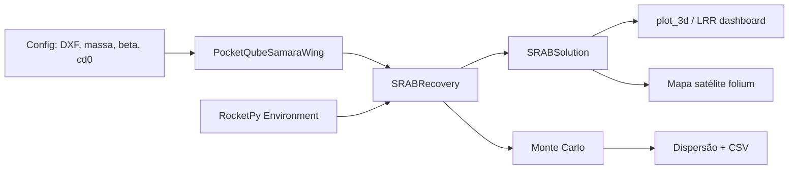

# rocketpy_samara

Integração do simulador SRAB (autorrotação bioinspirada) com o framework RocketPy para a Missão Helike (#213 — LASC 2026).

## Visão Geral

O pacote conecta o modelo de 4ª ordem de `samara_pq_simulation.py` ao ecossistema RocketPy, adicionando:

- Perfil atmosférico real (Standard Atmosphere ou GFS forecast)
- Deriva por vento (interpolado do Environment à altitude instantânea)
- Otimização de raio aerodinâmico para velocidade de impacto alvo
- Monte Carlo para quantificação de dispersão estatística
- Visualização 3D, dashboard LRR e mapa de satélite interativo

## Arquitetura



## Dependências

```
numpy
scipy
matplotlib
rocketpy>=1.2
folium          # opcional (mapa satélite)
```

## Módulos

### `srab_recovery.py`

Núcleo da integração.

**Classes:**

| Classe | Descrição |
|---|---|
| `SRABSolution` | Dataclass com resultados da descida. `x_impact`/`y_impact` como `@property`. |
| `EnvironmentAwareFlightDynamics` | Subclasse de `PocketQubeFlightDynamics` que atualiza `wing.rho` via `env.density.get_value_opt(z)` a cada passo ODE. |
| `SRABRecovery` | Wrapper principal. Gerencia wing, Environment, parâmetros e otimização. |

**SRABRecovery:**

```python
rec = SRABRecovery(
    wing,                          # PocketQubeSamaraWing
    env=None,                      # RocketPy Environment (None = ρ constante)
    dxf_path=..., n_wings=2,
    mass_kg=0.200, altitude_m=1000.0,
    theta_deg=0.0, theta_dot_0=0.0, phi_dot_0=0.0, v0_0=0.0,
    beta_deg=3.0, cd0=1.0, f_factor=0.3, rho=1.225,
    t_max=600.0, max_step=0.2,
    optimize=False, target_vf=20.0, safety_factor=1.5,
)
sol = rec.simulate()               # SRABSolution
sol = rec.simulate_from_flight(flight)  # extrai apogeu do RocketPy Flight
```

**Parâmetros de otimização:**

Quando `optimize=True`, `target_vf` e `safety_factor` definem a velocidade alvo: `vf_target = target_vf / safety_factor`. O raio aerodinâmico é ajustado iterativamente até que `|v_impacto - vf_target| < 0.01`.

**SRABSolution:**

| Campo | Descrição |
|---|---|
| `t` | array (N,) — tempo |
| `altitude` | array (N,) — altitude AGL |
| `v0` | array (N,) — velocidade vertical |
| `theta` | array (N,) — ângulo de conicidade |
| `phi_dot` | array (N,) — taxa de rotação |
| `x` | array (N,) — posição X (offset da liberação) |
| `y` | array (N,) — posição Y |
| `x_impact` | float — X no impacto (`x[-1]`) |
| `y_impact` | float — Y no impacto (`y[-1]`) |
| `t_impact` | float — tempo total de descida |
| `v_impact` | float — velocidade vertical no impacto |
| `spin_impact_rpm` | float — RPM no impacto |
| `theta_eq` | float — θ de equilíbrio (mediana do último quinto) |

---

### `monte_carlo.py`

Análise de sensibilidade estatística.

**Classes:**

| Classe | Descrição |
|---|---|
| `StochParam` | Definição de parâmetro estocástico (distribuição, média, desvio) |
| `SRABMonteCarlo` | Loop de simulação serial com perturbação de parâmetros |

**StochParam:**

```python
StochParam(name, dist="normal", mean=0.0, std=0.0, low=0.0, high=1.0)
```

Distribuições suportadas: `"normal"`, `"uniform"`, `"discrete"`.

**SRABMonteCarlo:**

```python
mc = SRABMonteCarlo(base_recovery, n_iterations=100)
mc.add_param("mass_kg", dist="normal", mean=0.200, std=0.020)
mc.add_param("beta_deg", dist="normal", mean=3.0, std=1.0)
mc.add_param("cd0", dist="normal", mean=1.0, std=0.1)
mc.process()

mc.results         # dict com arrays de saída
mc.summary()       # print de estatísticas
mc.export_csv("mc.csv")  # exporta tabela completa
```

O método `process()` perturba os parâmetros via `deepcopy` da asa base, chamando `_initialize_inertia_tensor()` e `_apply_geometry_scaling()` quando necessário.

---

### `plotting.py`

Visualizações.

**Funções:**

| Função | Descrição |
|---|---|
| `plot_ascent_descent_3d(flight, srab_sol)` | Trajetória 3D completa (subida RocketPy + descida SRAB) |
| `_plot_srab_only(srab_sol)` | Apenas descida SRAB em 3D |
| `plot_dispersion(mc)` | Scatter de impactos MC + elipse CEP 1σ |
| `plot_lrr_dashboard(srab_sol)` | Relatório LRR 2×2 (altitude, velocidade, θ, spin) |
| `plot_trajectory_map(srab_sol, lat, lon)` | Mapa satélite interativo com folium |

Todas retornam a figura/mapa para o caller decidir como salvar ou exibir.

**plot_trajectory_map:**

```python
# Salvar HTML
plot_trajectory_map(sol, lat=-21.9389, lon=-48.9504,
                    filename="mapa.html")

# Ou obter objeto folium.Map
m = plot_trajectory_map(sol, lat=-21.9389, lon=-48.9504)
m.save("mapa.html")
```

Usa ESRI World Imagery (satélite gratuita, sem API key). Converte offset (x, y) em metros para coordenadas geográficas.

---

## Fluxo típico

### 1. Simulação básica com otimização

```python
from samara_pq_simulation import PocketQubeSamaraWing
from rocketpy_samara import SRABRecovery

wing = PocketQubeSamaraWing(
    dxf_path="geometry/Asa3.DXF",
    n_wings=2, mass=0.200,
    f_factor=0.3, cd0=1.0, rho=1.225, beta_deg=3.0,
)

rec = SRABRecovery(wing, env=None,
    altitude_m=1000.0, t_max=600.0, max_step=0.2,
    optimize=True, target_vf=20.0, safety_factor=1.5)
sol = rec.simulate()

print(f"v_impacto: {sol.v_impact:.2f} m/s")
```

### 2. Com GFS forecast

```python
from datetime import datetime, timedelta
from rocketpy import Environment

env = Environment(latitude=-21.9389, longitude=-48.9504,
                  elevation=500, date=datetime.now() + timedelta(days=1))
env.set_atmospheric_model(type="forecast", file="GFS")

rec = SRABRecovery(wing, env=env, ...)
sol = rec.simulate()
print(f"Deriva: ({sol.x_impact:.1f}, {sol.y_impact:.1f}) m")
```

### 3. Monte Carlo

```python
from rocketpy_samara import SRABMonteCarlo

mc = SRABMonteCarlo(rec, n_iterations=100)
mc.add_param("mass_kg", "normal", 0.200, 0.020)
mc.add_param("beta_deg", "normal", 3.0, 1.0)
mc.process()
mc.summary()
mc.export_csv("mc_results.csv")
```

### 4. Todos os plots

```python
from rocketpy_samara.plotting import (
    _plot_srab_only, plot_lrr_dashboard, plot_trajectory_map
)

_plot_srab_only(sol).savefig("trajetoria_3d.png")
plot_lrr_dashboard(sol).savefig("lrr_dashboard.png")
plot_trajectory_map(sol, lat=-21.9389, lon=-48.9504,
                    filename="mapa.html")
```

## Ambiente atmosférico

| Modelo | ρ(0) (kg/m³) | ρ(1000 m) (kg/m³) | Uso |
|---|---|---|---|
| `rho=1.225` (constante) | 1.2250 | 1.2250 | Testes rápidos |
| `StandardAtmosphere` | 1.2250 | 1.1115 | Validação |
| GFS forecast | ~1.176 | ~1.068 | Pré-voo real |

O efeito da ρ(z) é marginal abaixo de 1000 m (< 2.5% no tempo de descida), mas torna-se relevante em altitudes maiores.

O vento é integrado numericamente durante a descida. Sem vento (`env=None`), a trajetória é vertical (x = y = 0).

## Otimização

Quando `optimize=True`, o `SRABRecovery` utiliza `PocketQubeSamaraOptimizer` para encontrar o raio aerodinâmico que produz a velocidade de impacto desejada:

```
vf_target = target_vf / safety_factor
```

O otimizador usa busca binária no raio, resolvendo a ODE a cada iteração, até que o resíduo seja < 0.01 m/s.

## Exemplos

Na pasta do pacote:

| Script | Descrição |
|---|---|
| `demo_srab_recovery.py` | Simulação completa com otimização |
| `demo_env_rho.py` | Comparação ρ constante vs ρ(z) |
| `demo_monte_carlo.py` | Monte Carlo com 50 iterações |
| `demo_plotting.py` | Geração de relatórios LRR + 3D |

## Estrutura de saída

```
extras/results/
├── trajetoria_3d.png         # Trajetória 3D da descida
├── lrr_dashboard.png         # Dashboard LRR 2×2
├── mapa_satelite.html        # Mapa satélite interativo
├── samara_pq_geometry_views.png  # Vistas geométricas da asa
└── mc_srab_demo.csv          # Resultados Monte Carlo
```

## Ver também

- `samara_pq_simulation.py` — modelo de 4ª ordem original (intacto)
- `srab_field_analysis.py` — análise de dados de teste de campo
- `docs/2026-06-19-proposta-tecnica-srab-lasc-v2.md` — proposta técnica atualizada
